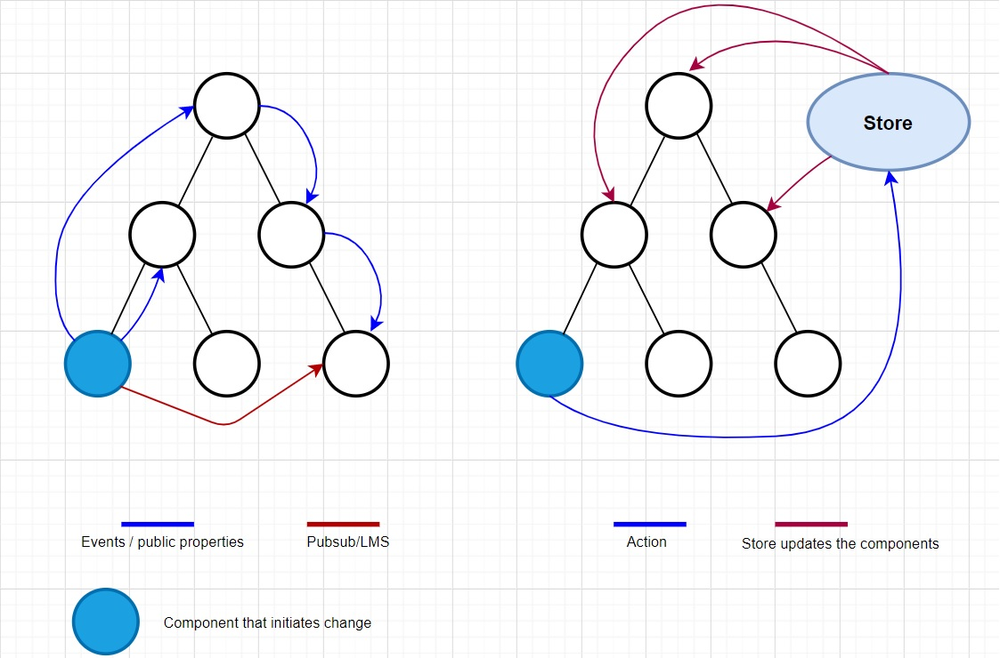
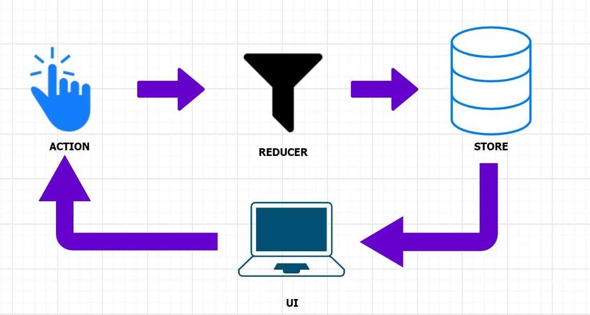

# lwc-redux
 Highly opinionated Redux state container implementaion for Lightning Web Components


This package is highly opinionated implementation of Redux which is a predictable state container for JavaScript apps, with LWC and basically a wrapper around the Redux libraries alongside a few middlewares that a you might need. It helps you write applications that behave consistently. 

This design allows you to separate your large, Single Page, multiple module containing LWC application into basic layers:
    - Apex  : Service Layer
    - LWC   : View Layer
    - Store : Data Layer
    
It also helps you separate the logic into chunks which only concern with similar intents.

e.g: your Single Page Application might have different modules; which can be managed separately using multiple reducers, which in turn helps you keep the state orgagnized.

# Motivation

As the requirements for LWC single-page applications have become increasingly complicated, our code must manage more events than ever before. UI events are also increasing in complexity, as we need to manage active routes, selected tabs, spinners, pagination controls, and so on.

Managing this ever-changing situation is hard. If a component can update another component,  which updates another component, and this, in turn, might cause another component to update. At some point, you no longer understand what happens in your app as you have lost control over the when, why, and how of its events. When a system is opaque and non-deterministic, it's hard to reproduce bugs or add new features.

There's only a percentage of reusability which can be achieved when going with lwc, which requires the components to be loosely coupled through events. But what if we could create loosely coupled & abstract application modules that don't use event and yet can be re-used, this opens a path for us to create manageable and reusable bundle of Lightning Web Components.

Frameworks like LWC and LockerService attempt to solve this problem in the view layer by removing direct DOM manipulation. However, managing the state of your data is left up to you. This is where lwc-redux enters.

# Three Principles of Redux

- ##### Single source of truth -
    - App Data is Centralized in Stores as a defined Data-Structure.
    - i.e. global state of your application is stored in an object tree within a single store.

- ##### State is read-only  
    - App Data cannot be directly modified.
    - The only way to change the state is to emit an action, an object describing what happened.

- ##### Changes are made with pure functions
    - To specify how the state tree is transformed by actions, you write pure reducers which are, on a basic level, functions.

lwc-redux works without any conflicts with Lightning Web Components Framework in your Lightning Experience and is also not affected by LockerService.

Here are some intuitive images that might click you:
# lwc-redux comparison



# lwc-redux architecture:



##### State : Residing inside the store is you Immuatble application state, this state can only be mutated when an action is dispatched, since it is a Data Structure, and you want to keep the application state in a namespaced way, you need to define your your state carefully. Keep the intentions of different parts of your state separate using reducers.

##### Reducers : Reducers will help you keep your state organized and will only mutate the part of state they maintain.

##### Actions : Actions are simple, Asynchronous and Synchronous, Asynchronous actions will fetch the data from apex methods/ perform other asynhc operations, but will later invoke a synchronous action to finally get the processed data into state.


# Get Started:

As we already mentioned, the implementation is a wrapper around Redux and LWC which lets you implement Redux with Lightning Web Components with milimal efforts. At the very core of this is reduxModule, here's all the exports:

    DEFAULT_STORE (String): Default name of the store if you don't specify.
    createReducer (function): Method to create a reducer.
    fetchAllStoreNames (function): Fetch all the names of stores that are subscribed by the component
    enqueueDispatch (function): Method to dispatch an action.
    unsubscribeAllStores (function): Unsubscribe All stores at once, typically used in disconnectedCallback
    LightningReduxElement (Class): Class which replaces LightningElement when implementing redux.

### To create a Store:

The LWC passed as slot to the redux-module component and all its child components should typically extend LightningReduxElement instead of LightningElement.
```
<c-redux-module store-name="MYFIRSTSTORE" use-logger combine-reducers reducer={reducer}>
        <c-simple-redux-show-contact></c-simple-redux-show-contact>     <!-- root component of your application that extends LightningReduxElement -->
</c-redux-module>
```
### To create a Reducer:

```
import { createReducer } from 'c/reduxModule';
const reducer = createReducer((currentState, draftState, action) => {
    switch (action.type) {
        case 'LOAD_CONTACTS': {
            draftState.contacts = action.contacts;
            return draftState;
        }
        case 'REMOVE_CONTACTS': {
            draftState.contacts = draftState.contacts.filter((storeVal) => {
                return storeVal.Id !== action.contactId;
            });
            return draftState;
        }
        default: {
            return draftState;
        }
    }
});
```
### Create async and sync Actions:
```
/*
  this is a sync action, it has a type and can carry payload. 
  sync actions typically will deal with state.
  they should not perform any logic, and should return an object with following definition.
    {
      type : <required property which identifies which action was fired on state change and maps to a reducer. value should be unique>,
      you can add other properties as needed.
    }
*/
const loadContacts = (contacts) => {
  return {
    type: 'LOAD_CONTACTS',
    contacts: contacts
  }
}

/*
  this is a async action, it does async activities such as fetching data from api or apex method and then 
  it dispatches a sync action to update the information in state.
  async actions typically get data from an async operation and pass it over to a sync action.

  in below example: 
  loadContactsAsyncAction returns a function which takes "dispatch" as a parameter, and invokes an
  apex imperative method which fetches contacts and passes into "loadContacts() sync action" which in turn
  is passed inside the dispatch() to update the state.

*/
const loadContactsAsyncAction = () => {
  return dispatch => {
    getContacts().then(response => {
      dispatch(loadContacts(response));     //call dispatch to dispatch your sync action inside the async action.
    });
  }
}
```

### Dispatch async and sync Actions:
```
    /*
    enqueueDispatch() is async and returns a promise.
        param1 : storeName
        param2 : action to be dispatched

    below example dispatches a sync action
    */
    enqueueDispatch(DEFAULT_STORE, loadContacts([{
        Name : 'Prashant',
        Id : '123'
    },
    {
        Name : 'Yash',
        Id : '234'
    }])).then(()=>{
        /* 
            this is an example of how async actions should be fired.
        */
        enqueueDispatch(DEFAULT_STORE, loadContactsAsyncAction());
    });
```
### State is Immutable:
```
/*
        properties which are updated by state directly are readonly, and should not be updated directly 
        as these are part of data layer and should be updated using actions only.
        below code will not work.
    */
    remove(event){
        this.contacts = this.contacts.filter((storeVal) => {
            return storeVal.Id !== event.target.dataset.contactId;
        });

        console.log(this.contacts);
    }
```
### Implementation to connect LWC with Store:
```
export default class SimpleReduxShowContact extends LightningReduxElement {
    
    //component property, @track so it can be reactive and updated as soon as an action mutates the state.
    @track contacts;                    
    
    constructor(){
        let mapStateToProps = ['contacts'];         //if specified as an array, component propName should typicall match with state propName
        /*
            super invocation, 
            1st param : if passed null, reduxModule will replace with DEFAULT_STORE
            2nd param : passed mapStateToProps as specified above.
            3rd param : implementation of connector method to let you define how your component interacts with state.
        */
        super(DEFAULT_STORE, mapStateToProps, (state, component) => {
            if (state && component && component.mapStateToProps) {

                component.mapStateToProps.forEach((prop) => {
                    component[prop] = state.contactstate[prop];         //contactstate is the namespace created for reducer1
                });

            }
        });
    }
```

### Unsubscribe from stores whem LWC is removed from DOM

```
    disconnectedCallback(){
        //use unsubscribe all stores when component is removed from DOM. pass this reference to unsubscribe.
        unsubscribeAllStores(this);
    }
```